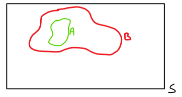



# Definizione assiomatica di probabilità

## Assiomi di Kolmogorov

Dato un esperimento che preveda più esiti possibili e a cui è associato **uno spazio campione \\(S\\)**, e dato un **evento \\(E \subset S\\)**, si definisce **probabilità** di \\(E\\) come:

\\[
P(E) \in \mathbb{R}
\\]

### Assioma 1

\\[
0 \leq P(E) \leq 1
\\]

### Assioma 2

\\[
P(S) = 1
\\]

### Assioma 3

Siano \\(E_1, E_2, \dots \subset S \\) **mutuamente esclusivi** (o **disgiunti**), allora vale:

\\[
P\left(\bigcup_{i=1}^{m} E_i\right) = \sum_{i=1}^{m} P(E_i)
\\]

Ovvero, la probabilitù dell'unione degli eventi è uguale alla somma delle probabilità dei singoli eventi.

## Conseguenze

### Proprietà 1 - Complementare

Dato un evento \\(E \subset S\\), vale:

\\[
P(E^C) = 1 - P(E)
\\]

dove con \\(E^C\\) si intende il complementare di \\(E\\).

#### Dimostrazione


E \cup E^C = S \\
E \cap E^C = \emptyset \\
\underbrace{1 = P(S)}_{\text{Assioma 2}} =
\underbrace{P(E \cup E^C) = P(E) + P(E^C)}_{\text{Assioma 3}}\\

P(E) + P(E^C) = 1 \rightarrow P(E^C) = 1 - P(E) \quad \blacksquare


### Proprietà 1bis - Insieme vuoto

\\[
P(\emptyset) = 0
\\]

#### Dimostrazione


S^C = \emptyset \\
P(\emptyset) \underbrace{=}_{\text{P1}} P(S^C) = 1 - P(S) \underbrace{=}_{A2} 1-1 = 0 \quad \blacksquare


### Proprietà 2 - Proprietà di un sottoinsieme



Siano \\(A, B \subset S \quad \text{con} \quad A \subset B\\), si dimostra che:

\\[
P(A) \leq P(B)
\\]

Attenzione al **minore uguale**.

<--->



#### Dimostrazione

\\(
B = A \cup (B \cap A^C) = A \cup (B\setminus A)
\\)

Per costruzione \\(A \cap (B \setminus A) = \emptyset \\). Quindi \\(A\\) e \\((A\setminus B)\\) sono **mutuamente esclusivi**.

\\( P(B) = P(A \cup (B \setminus A)) = P(A) + P(B \setminus A) \\)

Per l'assioma 1, \\(P(B\setminus A) \ge 0\\), quindi

\\( P(B) = P(A) + P(B \setminus A) \ge  P(A) \rightarrow P(B) \ge P(A) \quad \blacksquare \\)

