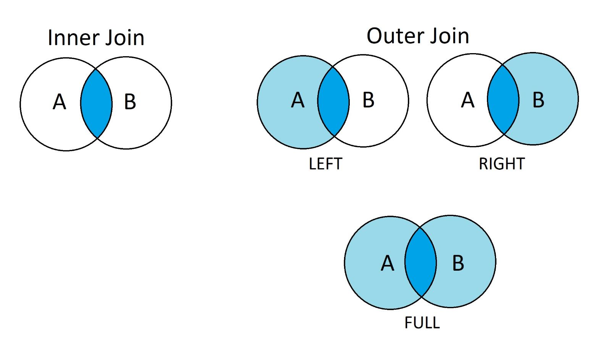

# Formulario per la prova di Sistemi Informativi T

## Algebra relazionale

### Operazioni

Selezione [\sigma]

Vuole un predicato e restituisce le tuple che soddisfano il predicato.

#### Proiezione [\pi]

Vuole una lista di attributi e restituisce le tuple con solo gli attributi indicati.

#### Join naturale [\bowtie]

- **Schema:** Unione degli schemi delle relazioni coinvolte.
- **Relazione:** Le tuple che hanno gli stessi valori per gli attributi in comune.

##### Self join

Serve la [ridenominazione](#ridenominazione) degli attributi.

##### <a name="differenza"></a> Differenza [-]

- **Schema:** Lo schema dei due operandi.
- **Relazione:** Le tuple che sono nel primo operando ma non nel secondo.

> **⚠️ ATTENZIONE:** Gli schemi dei due operandi **devono essere uguali**.

#### Ridenominazione [\rho]

Modifica lo schema di una relazione, cambiando i nomi di uno o più attributi.

##### Esempio

\rho\_{Nome=NomeCognome}(R)

#### <a name="divisione"></a> Divisione [\div]

- **Schema:** Lo schema di sinistra sottratto dello schema di destra.
- **Relazione:** Le tuple che moltiplicate per il divisore sono contenute nel dividendo

E' utile per trovare **un attributo di tipo universale**.

##### Esempio

_Le date in cui **tutte gli aerei** hanno volato_



| Codice | Data       |
| ------ | ---------- |
| AZ427  | 21/07/2001 |
| AZ427  | 23/07/2001 |
| AZ427  | 24/07/2001 |
| TW056  | 21/07/2001 |
| TW056  | 24/07/2001 |
| TW056  | 25/07/2001 |

<--->

| Codice |
| ------ |
| AZ427  |
| TW056  |

<--->

| Data       |
| ---------- |
| 21/07/2001 |
| 24/07/2001 |



#### Theta-Join

Corrisponde al `JOIN` SQL che si usa di solito. Ovvero fa il prodotto cartesiano delle relazioni e poi applica il predicato.

- **Schema:** Unione degli schemi delle relazioni coinvolte.
- **Relazione:** Le tuple che soddisfano il predicato.

Di solito il predicato serve per associare le due relazioni. Ad esempio:

```
p := Aerei.Codice = Voli.CodiceAereo
```

### Algebra relazionale con valori nulli

\pi e \cup e - continuano a funzionare come prima.

#### \sigma con valori nulli

In generale, se confrontiamo con un valore (non nullo), allora `NULL != valore`, per qualsiasi valore.

Se invece vogliamo confrontare con `NULL`, dobbiamo usare i seguenti operatori:

- `IS NULL`
- `IS NOT NULL`

##### Esempio

```sql
SELECT * FROM Aerei WHERE Codice IS NULL
```

#### \bowtie con valori nulli

In generale, due tuple che hanno null su attributi in comune, non vengono considerate uguali, quindi non le troveremo nel risultato.

> **ATTENZIONE:** L'intersezione, **IN ASSENZA DI VALORI NULLI** può essere ottenuta con un join naturale. Al contrario, l'intersezione **IN PRESENZA DI VALORI NULLI** non può essere ottenuta con un join naturale, ma con la formula:
> r_1 - (r_1 - r_2)

#### Outer Join



## Da ricordare

### Date

#### Formato su DBeaver

_Data:_ 21 gennaio 2018

```sql
dd.MM.yyyy -> 21.01.2018
MM/dd/yyyy -> 01.21.2018
```

#### Funzioni

```sql
YEAR(data_var)  -- restituisce l'anno della data in formato intero
MONTH(data_var) -- restituisce il numero del mese (intero tra 1 e 12)
DAY(data_var)   -- restituisce il numero del giorno (intero tra 1 e 31)

DAYS(data_var)  -- restituisce i giorni trascorsi dal 01/01/0001
DAYS(data_2) - DAYS(data_1)  -- restituisce il numero di giorni trascorsi tra due date
```

### Orari

#### Formato su DBeaver

```sql
hh:mm:ss
hh:mm
```

#### Funzioni

```sql
HOUR(orario) -- restituisce l'ora
MINUTE(orario)  -- restituisce il minuto
SECOND(orario)  -- restituisce il secondo
```

#### Operazioni

```sql
 time1  -   time2    =  hhmmss -- di tipo time_duration
'17:15' - '15:12:45' = '020215'
```

Sui tipi **_time duration_** si possono utilizzare le funzioni `HOUR`, `MINUTE`, `SECOND`

### Funzioni utili

#### `DISTINCT`

Restituisce tutti i valori senza ripetuti (distinti)

```sql
SELECT DISTINCT col_1, DISTINCT col_2
```

#### `COALESCE`

Restituisce il primo valore non nullo.

```sql
COALESCE(NULL, 25) = 25
COALESCE(30, 20) = 30

SELECT EMPNO, COALESCE(SALARY, 0) -- restituisce 0 se lo stipendio è nullo
FROM EMPLOYEE
```

#### Casting

```sql
CAST(espressione AS tipo) -- prova a castare espressione a tipo
CHAR(stringa, N) -- restituisce i primi N caratteri di stringa
DEC(numero, p, q) -- restituisce numero in formato DEC(p, q)
INT(numero) -- restituisce la parte intera di numero
```

#### Registri di DB2

```sql
CURRENT USER
CURRENT DATE
CURRENT TIME
CURRENT TIMESTAMP
CURRENT SCHEMA
```

## Common table expressions (CTE)

```sql
WITH NomeCTE1(col1, col2, ...) AS (
	sql_query
),
NomeCTE2(col1, col2, ...) AS (
	sql_query
)
SELECT ...
```

## View

#### Creare una view

```sql
DROP VIEW NomeView;

CREATE VIEW **NomeView**(**col1**, *col2*, ...)
AS (*sql_query*)
```

#### [Droppare una view](https://www.db2tutorial.com/db2-view/db2-drop-view/)

```sql
DROP VIEW *NomeView*;
```

## Subqueries

#### Subquery scalari

ovvero che restituiscono non più di una tupla

```sql
WHERE (*col_1*, ..., *col_n*) <OPERATORE> (*subquery*)

<OPERATORE>:= < | > | < = | >= | <> | =
```

#### Subquery NON scalare

```sql
WHERE (*col_1*, ..., *col_n*) <OPERATORE> <CONFRONTO> (*subquery*)

<OPERATORE>:= < | > | < = | >= | <> | =
<CONFRONTO>:= ANY | ALL

-- la forma '= ANY' equivale a
WHERE (*col_1*, ..., *col_n*) IN (*subquery*)
```

Predicato `EXISTS`:

```sql
WHERE EXISTS     (*subquery*)
WHERE NOT EXISTS (*subquery*)
```

## Triggers

Per rimuovere un trigger

```sql
DROP TRIGGER NomeTrigger;
```

### Before trigger

```sql
CREATE [OR REPLACE] TRIGGER trigger_name
	BEFORE {INSERT | UPDATE | DELETE} [OF col]
	ON {table_name | view_name}
	REFERENCING {OLD AS | NEW AS} Riga
	FOR EACH ROW
	[WHEN (condizione)]
	-- per annullare:
	SIGNAL SQLSTATE '70000' ('<Stringa di errore>')
	-- per cambiare la riga:
	SET col = (query)
```

### After trigger

```sql
CREATE [OR REPLACE] TRIGGER *NomeTrigger*
	AFTER {INSERT | DELETE | UPDATE} [OF *COLONNA*]
	ON {table_name | view_name}
	REFERENCING {OLD | NEW} AS as RigaMod
	-- oppure: per le tabelle
	[REFERENCING {NEW_TABLE | OLD_TABLE} AS TabellaMod]
	FOR EACH {ROW | STATEMENT}
	-- per annullare:
		SIGNAL ...
	-- per fare un azione sempre
		query_sql;
	-- per fare un azione quando una condizione è soddisfatta
		[WHEN (*CONDIZIONE*)]
		*query_sql*
	-- oppure
		IF (condizione) query_true; ELSE query_false; END IF
```

### Suggerimenti utili

#### Variabili

E' possibile dichiarare variabili, da dichiarare preventivamente e a cui assegnare il risultato di una query.

```sql
CREATE OR REPLACE TRIGGER NomeTrigger
...
BEGIN ATOMIC
	DECLARE variabile INT;
	...
	SET variabile = (SELECT ...);
	...
END;
```

## Conversione Schema → SQL

1. Generare il file SQL da DB-Main con il comando _Transform/Quick SQL_
2. Modificare in DBeaver lo script in modo che sia compatibile con DB2, ossia:
   1. Eliminare `CREATE DATABASE` e tutta la `Index Section`
   2. Eliminare i `CHECK` complessi (cioè che hanno subquery)
   3. Usare tipi di dato gestibili da DB2

> 👉 E’ possibile lasciare il default char(1) per tutti gli attributi non coinvolti nel punto successivo

## Contributi

- [VaiTon](https://github.com/VaiTon)
- [xWiimarco](https://github.com/xWiimarco)
